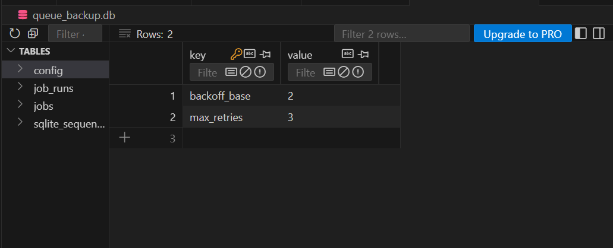
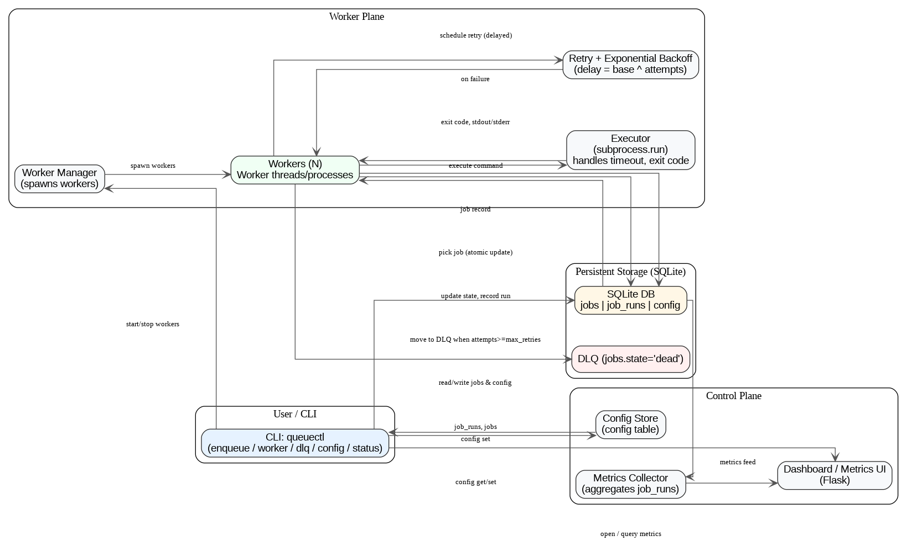
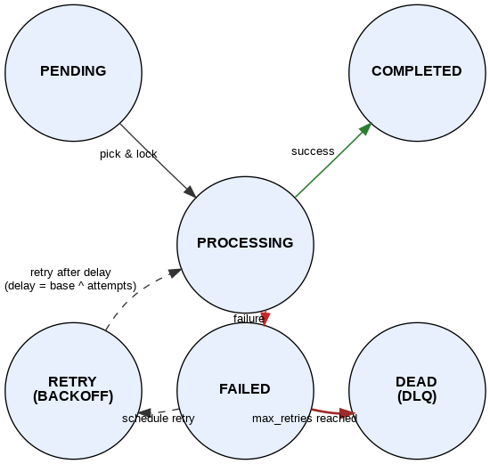

QueueCTL 

QueueCTL is a simple CLI-based background job queue system built using Python and SQLite. It allows users to enqueue commands, run multiple background workers to process jobs, manage retries with exponential backoff, and maintain a Dead Letter Queue (DLQ) for permanently failed jobs.
The system incorporates persistence, metrics collection, and a small Flask-based monitoring dashboard.

Setup Instructions:
cd "FLAM TASK"
pip install -r requirements.txt
Initializing the database: The first time I run any command, queue.db (SQLite database) will be created automatically with all required tables.
All operations are performed using:
python queuectl.py <command>

Usage Examples:

1. Enqueue a Job
We can add a new job directly or from a JSON file.
From JSON file:
python queuectl.py enqueue --file job_vs1.json
Example job_vs1.json:
{
  "command": "echo hello from vscode",
  "max_retries": 2
}
Direct inline enqueue:
python queuectl.py enqueue "{\"command\": \"echo Hello\"}"

2. Start Worker(s)
Starts one or more workers to process jobs.
python queuectl.py worker start --count 1
Press Ctrl + C to stop workers gracefully (they finish current jobs before stopping).

3. View Job Status
Displays total jobs and count by states.
python queuectl.py status
Example output:
Job counts by state:
  pending: 0
  processing: 0
  completed: 2
  failed: 0
  dead: 1
Metrics summary:
  total_jobs: 3
  success_runs: 2
  failed_runs: 1

4. List Jobs
python queuectl.py list --state pending
Lists all jobs filtered by state (pending, completed, failed, dead).

5. Dead Letter Queue (DLQ)
Failed jobs after max_retries move to DLQ automatically.
View DLQ jobs:
python queuectl.py dlq list
Retry a dead job:
python queuectl.py dlq retry <job_id>

6. Configuration
Set or get system configuration parameters (like retry count, backoff base).
python queuectl.py config set max-retries 3
python queuectl.py config get max-retries

7. Dashboard
Run the monitoring dashboard:
python dashboard.py
Then open in browser:
http://127.0.0.1:5000
It shows:
Total jobs by state
Job list with status
DLQ count and metrics summary

Architecture Overview:

The system is divided into four main layers:

CLI Interface (queuectl.py):
Main entry point for all operations (enqueue, worker, DLQ, config, metrics).
Uses click for command-line interaction.
Handles user input, job validation, and DB interaction.

Database Layer (db.py):
Uses SQLite for persistent job storage.

Tables:
jobs: stores job details and states.
job_runs: logs each execution attempt.
config: stores system parameters like retry count and backoff base.
Ensures jobs persist across restarts.

Worker Plane (worker.py):
The Worker Manager spawns multiple worker threads.
Each worker:
Picks one pending job.
Marks it as processing.
Executes the command using subprocess.run().
On success → marks job as completed.
On failure → retries using exponential backoff (delay = base ^ attempts).
After max_retries, moves the job to DLQ (state='dead').

Dashboard (dashboard.py):
Flask-based web view to monitor jobs.
Displays total job counts by state, DLQ count, and recent jobs.

Assumptions & Trade-offs

SQLite is used for simplicity and persistence (no external DB needed).
Workers are implemented as threads, not separate processes (simpler for local testing).
Jobs are simple shell commands; no argument parsing or sandboxing.
Exponential backoff uses a base defined in configuration (base_backoff).
Graceful shutdown ensures workers finish current jobs before stopping.
Minimal dashboard (Flask) is for monitoring only; no job control actions from web.

Testing Instructions:
We can test all scenarios manually using the CLI:
Basic Success Job
        python queuectl.py enqueue --file job_success.json
        python queuectl.py worker start --count 1

Failed Job and DLQ
Create a job with an invalid command:

{
  "command": "invalid_command",
  "max_retries": 2
}

Enqueue and start the worker:
        python queuectl.py enqueue --file job_fail.json
        python queuectl.py worker start --count 1

After retries, verify:
        python queuectl.py dlq list

Retry Verification
Retry a dead job:
        python queuectl.py dlq retry <job_id>

Check if it reappears under pending state:
        python queuectl.py list --state pending

Configuration Test
        python queuectl.py config set max-retries 5
        python queuectl.py config get max-retries

Persistence Test

Stop and restart the app:
        python queuectl.py status

All job states should remain stored (persistent in queue.db).

This backend system demonstrates:

Persistent background job queue using SQLite
Multi-worker parallel processing
Retry with exponential backoff
DLQ management
Configurable parameters via CLI
Job run logging and monitoring through a Flask dashboard
It’s designed for clarity, modularity, and correctness — all required functionalities are implemented and verifiable through command-line testing.

DEMONSTRATION VIDEO LINK: https://drive.google.com/file/d/1FvEh5Ab5x6DTY48fxkfyOcA8DIN2ElhS/view?usp=sharing
